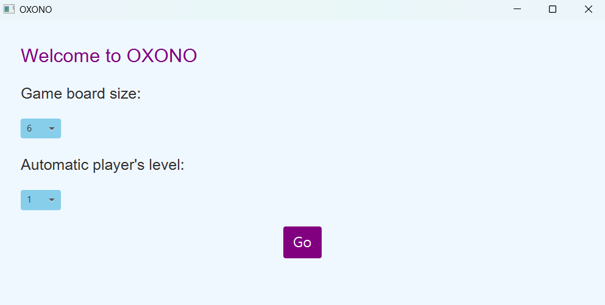

# Nom du projet : Oxono

  

## Description du Projet

Oxono est un jeu de plateau opposant deux joueurs, les roses et les noirs. C’est un jeu
d’alignement simple et redoutable où les diagonales n’existent pas. Pour gagner : aligner
4 pièces de la même couleur ou 4 pièces du même symbole.

## Choix de l'Architecture

L'architecture retenue pour ce projet est _model-view-controller_. 

## Installation et utilisation

Pour utiliser l'application, suivez les étapes suivantes : 

1. Clonez ce repository :
   ```bash
   git clone https://github.com/ZekriAyoub/oxono.git
   ```
2. Assurez-vous d'avoir Maven installé, puis exécutez la commande suivante pour compiler le projet avec Maven :
   ```bash
   mvn clean compile
   ```
3. ```bash
   cd oxono
   ```      
4. Démarrez l'application en exécutant la commande :  
   ```bash
  mvn exec:java "-Dexec.mainClass=g63551.dev3.oxono.Main"
   ```

## Aperçu de l'application

### Interface d'accueil


### Plateau de jeu

